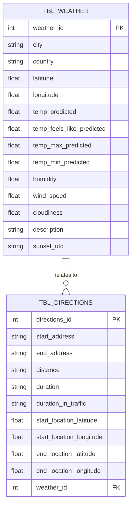

# 1. Extração de Dados

Para obter os dados sobre Clima e Trânsito, utilizei a API da `OpenWeather` e `Google Maps`. 

A API da OpenWeather pode ser obtida com a `Current Weather Data`, na página API, ao criar a chave de acesso e inserir a chave no link da API. 

Para obter a chave do Google Maps, é preciso crair um projeto no GCP e ativar as API´s listadas abaixo.

- Directions API
- Geocoding API
- Maps JavaScript API

Em seguida, devemos baixar o pacote `googlemaps` para usar os serviços via Python.

Como plano de acesso da chave para ambas API´s, cada uma possui um plano diferente:

- OpenWeather: A plataforma não permite cadastrar usuários no plano grátis. Portanto, uma alternativa é o compartilhamento da API ou disponibilizá-la em um servidor próprio ou serviço de storage. A primeira opção é a menos segura, uma vez que qualquer transporte de mensagem pode ser vazado. A segunda opção é mais segura, uma vez que técnicas de segurança são aplicadas em provedores de nuvem ou em servidores próprios, como VPN.
- Google Maps: O usuário deve ser cadastrado no projeto, ter as roles de leitura da API para ler os dados ao fazer requisições. A chave de acesso pode ser disponibilizada por um usuário de serviço, que disponibiliza a chave criptografada.

# 2. Limpeza e Transformação:

Tratamentos realizados:

**extract_weather_data.py**:  
- unity_transform: Transforma valores percentuais em suas representações decimais.  
- create_weather_index: Cria coluna de índice. Cada vez que uma nova instância for criada, a função é chamada em sequência
- utc_transform: Altera a data e hora UTC para a data e hora local, armazenando o valor em uma nova coluna `local_time`.

# 3.Modelagem de dados

O clima de cada cidade deve fazer referência de uma ou mais direções.

# 4. Integração com o Banco de Dados

Para garantir a integridade entre os dados, no momento que uma nova consulta é feita na API, a ocorrência é salva no banco e os dados são extraídos. A última ocorrência de ambas as tabelas receberá o mesmo ID, e assim as informações poderão ser relacionadas.

# 5. Visualização

Há cards com informações do clima seguido de um gráfico abaixo com a melhor rota detectada pela API Google Maps.

**Nota**: Não consegui finalizar 100% das tarefas. Todo código foi gerado de forma que fosse possível criar uma aplicação que tornasse o fluxo flúido. Havendo uma nova possibilidade de disponibilização de tempo para finalizar toda a aplicação, basta sinalizar por e-mail. Estimo que em mais um dia toda a aplicação ficará pronta - obs: 50% foi construído em 1 dia -.

# Como usar o projeto?

Além do plano de acesso às chaves da API, devem ser baixados os seguintes pacotes:

- pip install pandas
- pip install sqlalchemy
- pip install googlemaps
- pip install gmaps
- pip install python-dotenv
- pip install streamlit
- pip install geopy
- pip install pytz
- pip install timezonefinder

Para acessar a aplicação streamlit, use o terminal, acesse a pasta do projeto pelo terminal e digite o código `streamlit run app.py`.

